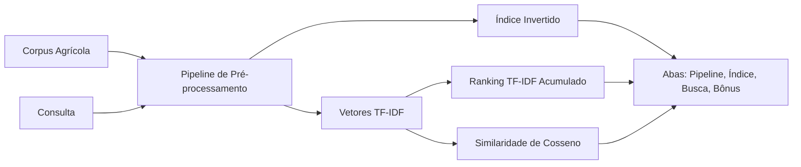
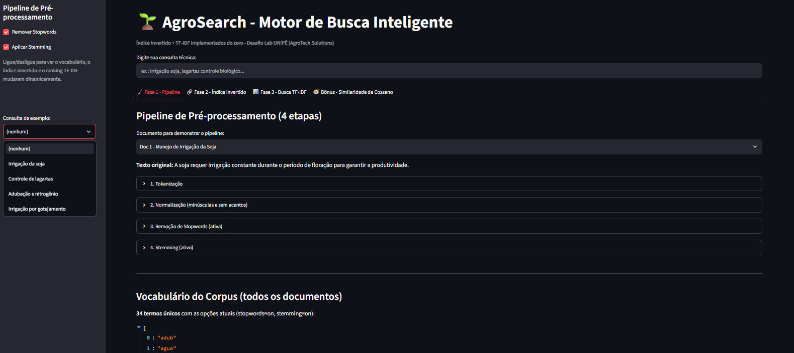

# AgroSearch – Motor de Busca Inteligente para Manuais Técnicos Agrícolas

AgroSearch é um protótipo de motor de busca textual que implementa Índice Invertido e TF-IDF do zero (sem bibliotecas de alto nível como scikit-learn) para ranquear manuais técnicos sobre agricultura sustentável, controle de pragas e irrigação. Tudo em um painel interativo feito em Streamlit.

**Deploy da Aplicação:** [agrosearch.streamlit.app](https://agrosearch.streamlit.app/)

[](https://agrosearch.streamlit.app/)

## Visão Geral

Este projeto é o Laboratório Prático 04 - Desafio Integrador da disciplina de Tópicos Avançados em Recuperação de Informação / PLN. A ideia é mostrar, de forma visual, como um índice invertido e o TF-IDF implementados do zero já produzem um ranqueamento coerente de relevância, sem depender de bibliotecas prontas.

---

## O Problema

A startup fictícia **AgroTech Solutions** tem uma base interna de manuais técnicos sobre agricultura sustentável, controle de pragas e irrigação, e seus técnicos de campo perdem tempo procurando informações específicas. Uma busca por texto simples (Ctrl+F / "contém") e um motor de busca com ranqueamento por relevância falham de formas diferentes:

| Abordagem | Onde acerta | Onde falha |
|---|---|---|
| Busca por texto simples (contém) | Encontra documentos que contêm a palavra exata | Não ranqueia por relevância: um documento com o termo repetido pesa igual a um com uma única ocorrência, e um termo raro e específico (ex.: "nitrogênio") pesa igual a um termo comum a vários documentos (ex.: "soja") |
| TF-IDF acumulado + Similaridade de Cosseno | Pondera termos raros com peso maior (IDF alto) e ranqueia os documentos por relevância | Depende de um vocabulário fixo pré-processado; não reconhece sinônimos, só variações do mesmo radical (via stemming) |

Exemplo: para a consulta *"irrigação soja"*, uma busca simples encontraria três documentos com "soja" (Doc 1, 2, 4) e dois com "irrigação" (Doc 1, 5), sem indicar qual é o mais relevante. O TF-IDF acumulado soma o peso dos dois termos por documento e revela que o Doc 1 (único a reunir ambos) é o vencedor (0.1784, contra 0.0639 dos demais), resultado confirmado pelo bônus de similaridade de cosseno (0.2572) numa escala normalizada.

---

## A Solução

O AgroSearch funciona em três fases, mais um bônus:

1. **Pipeline de pré-processamento** -> Tokenização, normalização (minúsculas e remoção de acentos), remoção de stopwords e stemming rudimentar. Stopwords e stemming podem ser ligados/desligados por checkbox na barra lateral, e o vocabulário do corpus muda dinamicamente.
2. **Índice Invertido** -> estrutura `Termo -> [IDs de Documentos]` construída em memória a partir dos tokens já pré-processados, exibida em tabela ou JSON.
3. **Busca e Ranqueamento TF-IDF** -> o usuário digita uma consulta; o sistema calcula TF, IDF e o TF-IDF acumulado por documento e exibe uma tabela ordenada da maior para a menor relevância, destacando o documento vencedor.

Há ainda um recurso extra opcional que calcula a similaridade de cosseno entre o vetor da consulta e o de cada documento, lidando melhor com consultas de múltiplas palavras.

---

## Fluxo da Aplicação



---

## Funcionalidades

* Checkboxes que ligam/desligam Stopwords e Stemming e recalculam tudo na hora.
* Quatro abas: pipeline de pré-processamento, índice invertido, busca TF-IDF e o bônus de similaridade de cosseno.
* Detalhamento passo a passo do cálculo de TF, IDF e TF-IDF por termo e documento.
* Destaque visual do documento vencedor em cada ranking.
* Consultas de exemplo prontas na barra lateral.

---

## Demonstração

Deploy do App: [agrosearch.streamlit.app](https://agrosearch.streamlit.app/)

| <div align="center">AgroSearch</div> |
|---|
|  |

---

## Estrutura do Projeto

```
agrosearch/
├── agrosearch_app.py          # Aplicação Streamlit (índice invertido + TF-IDF from scratch)
├── requirements.txt           # Dependências (streamlit, pandas)
├── data/
│   └── corpus_agricola.json   # As 5 manuais técnicos usados na busca (hardcode do enunciado)
├── .streamlit/
│   └── config.toml            # Configurações do streamlit
├── assets/
│   ├── UI-agrosearch.png      # Screenshot da interface
│   └── requisitos-agrosearch.pdf  # Requisitos originais do desafio
├── relatorio_tecnico_agrosearch.pdf
└── README.md
```

---

## Instalação e Execução

A forma mais rápida de testar é acessar a versão hospedada em
[agrosearch.streamlit.app](https://agrosearch.streamlit.app/) (o app pode
levar cerca de 30 segundos para acordar no primeiro acesso). Para rodar
localmente, siga os passos abaixo.

### 1. Pré-requisitos

* Python 3.10 ou superior - [Download](https://www.python.org/downloads/)
* Git - para clonar o repositório

### 2. Clonar o repositório

```bash
git clone https://github.com/PLeonLopes/agrosearch.git
cd agrosearch
```

### 3. Ambiente virtual e dependências

```bash
# Criar o ambiente virtual
python -m venv venv

# Ativar
venv\Scripts\activate           # <- Windows
source venv/bin/activate        # <- macOS/Linux

# Instalar as dependências
pip install -r requirements.txt
```

### 4. Rodar a aplicação

```bash
streamlit run agrosearch_app.py
```

O app abre automaticamente no navegador (`http://localhost:8501`).

---

## Como Usar

1. Digite uma consulta no campo principal, ou escolha um exemplo na barra lateral:
   * `irrigação soja` - irrigação na cultura da soja
   * `lagartas controle biológico` - controle biológico de pragas
   * `adubação nitrogênio milho` - adubação verde e nitrogênio
   * `irrigação gotejamento` - irrigação por gotejamento
2. Ligue/desligue **Stopwords** e **Stemming** na barra lateral e observe o vocabulário, o índice invertido e o ranking mudarem.
3. Compare os resultados nas abas:

| Aba | O que observar |
|---|---|
| Pipeline | As 4 etapas de pré-processamento, documento a documento |
| Índice Invertido | Mapeamento Termo -> Documentos |
| Busca TF-IDF | Ranking por TF-IDF acumulado e o documento vencedor |
| Bônus (Cosseno) | Ranking por similaridade de cosseno entre query e documentos |

---

## Parâmetros

| Parâmetro | Valores | Padrão | Para que serve |
|---|:---:|:---:|---|
| **Stopwords** | Ligado / Desligado | Ligado | Remove palavras sem valor de busca (ex.: "a", "de", "para") antes de indexar e buscar. |
| **Stemming** | Ligado / Desligado | Ligado | Reduz palavras a um radical comum (ex.: "irrigação" → "irrig"), aproximando variações do mesmo termo. |

Desligar Stopwords e Stemming aumenta o vocabulário do índice invertido e pode reduzir a precisão do ranking, já que palavras muito comuns passam a pesar tanto quanto termos técnicos específicos.

---

## Base de Documentos

| ID | Trecho |
|---|---|
| Doc 1 | A soja requer irrigação constante durante o período de floração para garantir a produtividade. |
| Doc 2 | O controle biológico de lagartas na soja pode ser feito com a vespa Trichogramma. |
| Doc 3 | A adubação verde com leguminosas melhora o nitrogênio no solo para o milho. |
| Doc 4 | Lagartas desfolhadoras causam grande prejuízo na cultura da soja e do algodão. |
| Doc 5 | A irrigação por gotejamento economiza água e é ideal para o cultivo orgânico. |

---

## Autor

<div align="center">
  <table>
    <tr>
      <td align="center">
        <a href="https://github.com/PLeonLopes">
          <br />
          <sub><b>Pedro Nícollas Pereira Leon Lopes</b></sub>
        </a>
      </td>
    </tr>
  </table>
</div>

<p align="center">
  <sub>UNIPÊ — Centro Universitário de João Pessoa · Prof. Me. Ricardo Roberto de Lima</sub>
</p>
